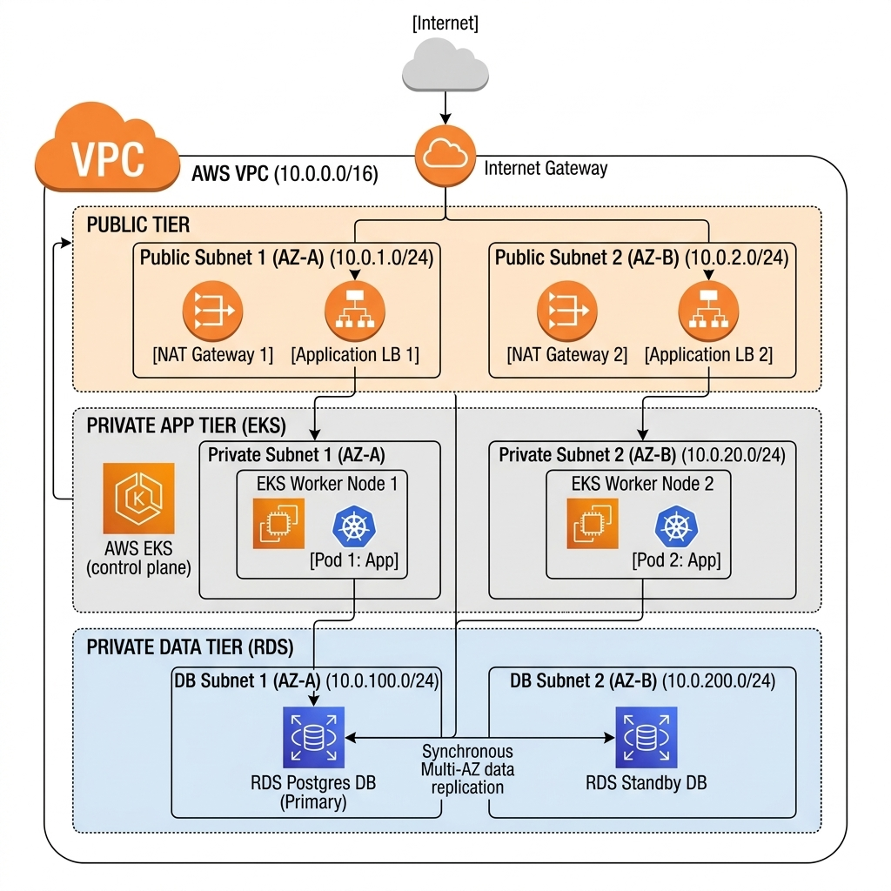

# AWS EKS & RDS Infrastructure (Local Emulation with Floci)

A modern cloud-native architecture that emulates a multi-tier AWS stack (VPC, EKS, RDS PostgreSQL, ECR) locally using Floci (K3s). The infrastructure is orchestrated with Kubernetes and the repository includes automation for building and deploying the application locally.

---

## Architecture

The infrastructure follows a strict 3-tier network separation (Public, Private App, Private Data) across two availability zones (Multi-AZ).



### Key Components

- VPC (10.0.0.0/16): overall network isolation
- Public Tier:
  - Public Subnet 1 (10.0.1.0/24) & Public Subnet 2 (10.0.2.0/24)
  - NAT Gateways and an Application Load Balancer (ALB) for ingress and outbound traffic
- Private App Tier (EKS):
  - Private Subnet 1 (10.0.10.0/24) & Private Subnet 2 (10.0.20.0/24)
  - EKS worker nodes running application pods (Node.js)
- Private Data Tier (RDS):
  - DB Subnet 1 (10.0.100.0/24) & DB Subnet 2 (10.0.200.0/24)
  - Primary PostgreSQL instance with synchronous Multi-AZ standby for high availability

---

## Technical Stack

- Infrastructure & Local AWS Emulation: Floci (K3s emulating AWS EKS, RDS PostgreSQL, local ECR)
- Orchestration: Kubernetes / K3s (Deployments, Services NodePort, Secrets, Ingress)
- Containerization: Docker (Node.js Alpine base image)
- Database: PostgreSQL
- CI/CD: GitHub Actions using a Self-Hosted Runner (Fedora)

---

## CI/CD Workflow

A sample automated deployment pipeline is provided in `.github/workflows/deploy.yml`:

Git Push ➔ Self-Hosted Runner ➔ Build Docker image ➔ Import image into local K3s runtime ➔ Kubernetes rollout restart

Steps overview:
1. Build image from the application (`app/Dockerfile`).
2. Import the resulting image into the local K3s container runtime (`ctr images import`).
3. Update Kubernetes Deployment to apply the new image without full cluster redeploy.

---

## Repository Structure

```text
.
├── app/
│   ├── Dockerfile
│   ├── package.json
│   └── index.js
├── kubernetes/
│   ├── deployment.yaml
│   ├── service.yaml
│   ├── secret.yaml
│   └── ingress.yaml
├── .github/
│   └── workflows/
│       └── deploy.yml
├── architecture.jpg
└── README.md
```

---

## Verification & Health Check

The application exposes a health endpoint that verifies connectivity to the PostgreSQL database.

Example: run the check against the NodePort (30080) on the Floci container:

```bash
# Execute inside the Floci container that hosts the local K3s NodePort
docker exec -it floci-eks-aws-eks-cluster-dev wget -qO- http://127.0.0.1:30080/health
```

Expected response:

```json
{
  "status": "UP",
  "db": "Connected to Postgres"
}
```

---

## License

This project is licensed under the MIT License — see the LICENSE file for details.

---

## Notes / Tips

- Save the architecture diagram image as `architecture.jpg` at the repository root to display it in the README.
- The Kubernetes manifests are provided in the `kubernetes/` directory. Adjust service type, nodePort, or ingress to match your local Floci/K3s setup.
